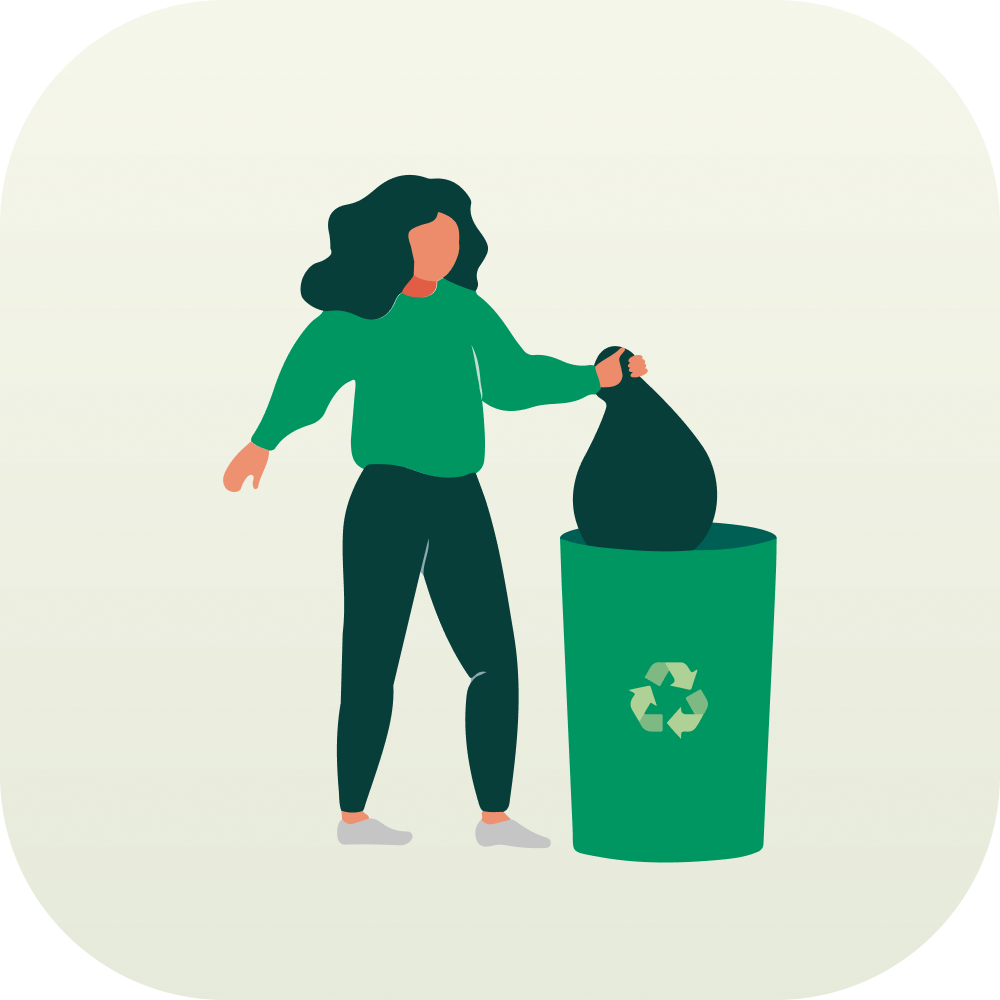

<h1 align="center">
  
</h1>

<h1 align="center">
  DFL - Web
</h1>

<p align="center">
  
    
</p>


## 💻 Project
An application that will help you to report garbage outbreaks and find collection points in your city.

## ✨ Technologies

- [ ] HTML
- [ ] CSS
- [ ] JavaScript
- [ ] React
- [ ] Next.js
- [ ] Material Icons
- [ ] Express
- [ ] Axios


## 🔖 Layout

You can view the layout of the project through [this link](https://www.figma.com/file/6PllN3nfMjMHgkNk6AKCRV). You need an account on [Figma](http://figma.com/) to access it.


## Running the project

Use **yarn** or **npm install** to install project dependencies.
Then start the project.

```cl
npm run start // or next dev for local development environments
```


## 📄 License

This project is under the MIT license. See the [LICENSE](LICENSE) file for more details.

<br />
